# Rumo

> **Aprenda, avance, conquiste.**

Plataforma de orientação estudantil com 70 guias em seis áreas, construída com Next.js, React e TypeScript. Gratuita, responsiva e sem necessidade de cadastro.

---

## TL;DR — Em poucas palavras

A Rumo é uma plataforma web criada por Gabriel Falcão da Cruz como parte de um projeto de extensão universitária do Bacharelado em Sistemas de Informação da UNIFACS. Sua concepção partiu de um diagnóstico realizado no contexto do Colégio Estadual Antônio Balbino, em Madre de Deus (BA), que identificou a dificuldade de estudantes em encontrar, compreender e organizar informações sobre estudos, futuro acadêmico e carreira. A plataforma reúne 70 guias em seis áreas temáticas — Estudar melhor, Pesquisa & IA, ENEM e pós-ENEM, Ensino superior, Carreira e mercado, e Inclusão e apoio — com busca por assunto, navegação por categorias, painel de acessibilidade e layout responsivo para celular e computador. A primeira versão funcional foi concluída e preparada para apresentação aos professores da escola em setembro de 2026.

| | |
|---|---|
| **Áreas** | 6 |
| **Guias** | 70 |
| **Cadastro** | Não exigido |
| **Custo** | Gratuito |
| **ODS** | 4 — Educação de Qualidade |
| **Versão** | Primeira versão funcional (setembro de 2026) |

---

## Sumário

1. [A história por trás da Rumo](#a-história-por-trás-da-rumo)
2. [O problema identificado](#o-problema-identificado)
3. [Como chegamos à solução](#como-chegamos-à-solução)
4. [A plataforma e seus conteúdos](#a-plataforma-e-seus-conteúdos)
5. [Desenvolvimento e decisões técnicas](#desenvolvimento-e-decisões-técnicas)
6. [Intervenção e registros da extensão](#intervenção-e-registros-da-extensão)
7. [Galeria da plataforma](#galeria-da-plataforma)
8. [Reconhecimentos](#reconhecimentos)
9. [Como executar o projeto](#como-executar-o-projeto)
10. [Arquitetura e organização](#arquitetura-e-organização)
11. [Validação e qualidade](#validação-e-qualidade)
12. [Documentação](#documentação)
13. [Autor e próximos passos](#autor-e-próximos-passos)

---

## A história por trás da Rumo

O ponto de partida da Rumo não foi escolher um framework nem desenhar uma interface. Foi sair do ambiente técnico e ir até uma escola.

O projeto nasceu dentro de uma atividade acadêmica real: a unidade de extensão **"Extensão Universitária: Cocriação e Desenvolvimento de Projetos – Ensino à Distância [Bloco 1]"**, integrada ao programa **Educação e Tecnologia Social** do curso de Bacharelado em Sistemas de Informação da UNIFACS. A proposta desse projeto não deixava margem para soluções inventadas do zero: era necessário observar um território real, ouvir pessoas, diagnosticar necessidades, analisar o que foi encontrado e, só então, propor uma intervenção com utilidade social concreta.

O território escolhido foi o **Colégio Estadual Antônio Balbino**, localizado em **Madre de Deus, Bahia**. A escola tem seu próprio cotidiano, recursos e desafios. O diagnóstico não chegou com uma lista de carências prontas para confirmar — chegou com perguntas, observação e disposição para ouvir. Foram considerados o contexto escolar, a gestão, a perspectiva dos estudantes, os recursos disponíveis e as necessidades que emergiram ao longo das conversas.

A tecnologia entrou depois. Quando o problema ficou claro, foi possível pensar em como a engenharia de software poderia ser útil para responder a ele.

### Linha do tempo do projeto

| Período | Etapa |
|---|---|
| Agosto de 2026 | Início do planejamento da extensão, escolha do território e preparação do diagnóstico |
| 28/08/2026 | Diagnóstico com a gestão escolar: entrevista com o vice-diretor, com registro de termo de imagem/voz e atestado de presencialidade assinado e carimbado |
| Após 28/08/2026 | Escuta de estudante e análise das necessidades identificadas, incluindo dúvidas sobre ENEM e trajetória futura |
| 02–03/09/2026 | Desenvolvimento da estrutura principal da plataforma, criação dos 70 guias e identidade visual |
| 03/09/2026 | Bate-papo com alunos sobre estudos, ENEM, futuro, carreira e tecnologia, realizado no Colégio Estadual Antônio Balbino |
| 08/09/2026 | Limpeza arquitetural, organização da base de código e preparação técnica da plataforma para apresentação |
| Setembro de 2026 | Intervenção principal: apresentação da Rumo aos professores da escola (próxima etapa planejada) |

> As datas de 28/08 e 03/09 correspondem a registros confirmados das atividades presenciais. Os commits de 02–03/09 e 08/09 documentam os marcos técnicos. A apresentação aos professores está prevista para setembro de 2026 e ainda não tem data registrada como realizada.

---

## O problema identificado

Durante o diagnóstico, um padrão foi se repetindo: estudantes encontravam dificuldade em localizar informações confiáveis sobre sua própria trajetória. Não era falta de acesso à internet — era falta de organização, clareza e orientação sobre onde procurar, como avaliar o que encontravam e o que fazer com isso.

A síntese que emergiu desse processo foi:

> **Dificuldade de estudantes em acessar, compreender e organizar informações úteis para sua trajetória escolar, acadêmica e profissional.**

Os temas que apareceram ao longo da escuta incluíam:

- organização dos estudos e rotina;
- pesquisa escolar e avaliação de fontes;
- uso responsável de tecnologia e inteligência artificial;
- preparação para o ENEM;
- dúvidas sobre o que fazer depois do ENEM;
- escolha de curso e ensino superior;
- oportunidades acadêmicas, bolsas e financiamento;
- carreira, primeiro emprego, currículo e estágio;
- inclusão, acessibilidade e apoio escolar.

A Rumo não foi criada para resolver todos esses problemas de uma vez. O recorte é mais específico: **organizar informações importantes, explicá-las de forma clara e ajudar estudantes a encontrar caminhos com mais autonomia**. Ela não substitui professores, coordenadores pedagógicos, profissionais de orientação ou qualquer serviço especializado.

---

## Como chegamos à solução

O raciocínio que levou à plataforma web seguiu uma ordem natural:

1. O diagnóstico apontou necessidades de orientação e organização da informação em diferentes temas da vida estudantil.
2. Era importante oferecer conteúdos em linguagem clara, organizados por assunto e acessíveis em diferentes dispositivos — inclusive no celular.
3. Uma plataforma web permitiria reunir guias, busca, navegação por categorias e recursos de leitura em um único lugar, sem depender de aplicativo ou cadastro.
4. A solução foi planejada para ser gratuita e de acesso simples, sem exigir infraestrutura sofisticada do lado do usuário.
5. O nome **Rumo** foi escolhido porque representa direção, movimento e a possibilidade de identificar o próximo passo — mesmo sem ter todas as respostas ainda.

A relação com o **ODS 4 — Educação de Qualidade** aparece na proposta de ampliar o acesso à informação orientada, reduzir barreiras de compreensão e apoiar a autonomia de estudantes. A Rumo não reivindica resolver desigualdades educacionais — busca contribuir com uma parte específica desse caminho.

---

## A plataforma e seus conteúdos

A Rumo está organizada em seis áreas temáticas, cada uma reunindo guias pedagógicos independentes com objetivos, sumário, orientações práticas e referências.

### Estudar melhor — 15 guias

Organização de rotina, foco e concentração, gestão do tempo, técnicas de estudo, anotações, revisão, procrastinação, interpretação de texto, matemática e preparação para provas.

*Exemplos:* "Como organizar seus estudos sem se sobrecarregar", "Técnicas de estudo que realmente funcionam", "Como revisar e fixar o conteúdo de forma eficiente".

### Pesquisa & IA — 10 guias

Pesquisa confiável na internet, avaliação de fontes, identificação de desinformação, uso responsável de inteligência artificial, criação de prompts para estudo, citação de fontes, privacidade e segurança digital.

*Exemplos:* "Pesquisa inteligente com IA: por onde começar", "Como saber se uma fonte é confiável", "Por que a IA pode errar e inventar informações".

### ENEM e pós-ENEM — 12 guias

Funcionamento do exame, preparação, estudo da redação, uso de provas antigas, cronograma, semana e dia da prova, resultado, Sisu, Prouni, Fies e escolha de caminhos após o ensino médio.

*Exemplos:* "Fiz o ENEM, e agora?", "Como funciona o ENEM", "Como organizar um cronograma para o ENEM".

### Ensino superior — 11 guias

Escolha de curso, pesquisa de instituições, diferenças entre bacharelado, licenciatura e tecnólogo, modalidades de ensino, grade curricular, custo de uma graduação, bolsas, vida universitária e planejamento dos primeiros semestres.

*Exemplos:* "Como escolher um curso superior", "Presencial, híbrido ou EAD: como escolher", "Como procurar bolsas de estudo".

### Carreira e mercado — 14 guias

Primeiro currículo sem experiência, adaptação do currículo por vaga, portfólio para estudantes, exploração de profissões, estágio, entrevistas, habilidades técnicas e comportamentais, LinkedIn, projetos pessoais e planejamento de carreira.

*Exemplos:* "Como montar seu primeiro currículo sem experiência", "Como procurar estágio pela primeira vez", "LinkedIn para estudantes: como começar".

### Inclusão e apoio — 8 guias

Acessibilidade na prática, diferentes formas de aprender, apoio escolar, materiais mais acessíveis, tecnologia assistiva, organização adaptável e respeito às diferenças no ambiente escolar.

*Exemplos:* "Acessibilidade: o que significa na prática", "Diferentes formas de aprender sem criar rótulos", "Tecnologia assistiva e recursos de acessibilidade".

---

### Recursos da plataforma

- **Navegação por categorias:** acesso direto às seis áreas, com destaques e trilhas de aprendizagem dentro de cada uma.
- **Guias estruturados:** cada guia tem objetivos, tempo estimado de leitura, sumário clicável, conteúdo organizado em seções e orientações práticas quando aplicável.
- **Busca:** localiza guias por título, resumo, tags e categoria, com tratamento de caixa, espaços e ausência de resultados.
- **Perguntas frequentes:** lista de dúvidas comuns e campo para perguntas abertas.
- **Painel de acessibilidade:** aumentar texto, alto contraste, reduzir movimento e restaurar padrão — disponível em todas as páginas.
- **Layout responsivo:** a interface se adapta a celulares, tablets e computadores.

> O painel de acessibilidade oferece controles visíveis de personalização. Não há certificação WCAG declarada: responsividade visual, contraste auditado e compatibilidade com leitores de tela não foram certificados por auditoria externa.

---

## Desenvolvimento e decisões técnicas

A Rumo também é um projeto real de engenharia de software. A arquitetura foi construída para separar conteúdo, domínio, serviços e interface, permitindo que cada guia seja atualizado sem afetar os demais.

### Stack

| Tecnologia | Versão |
|---|---|
| Next.js (App Router) | 16.3.3 |
| React | 19 |
| TypeScript | 5.7.3 |
| Tailwind CSS | 4 |
| Lucide React | — |
| Node.js (ambiente validado) | 22 |
| pnpm | 10 |

### Organização do código

```text
Conteúdo (data/guides/)
    ↓
Domínio (domain/)        ← contratos de categorias, guias, FAQ e busca
    ↓
Serviços (services/)     ← consultas locais e filtragem
    ↓
Componentes (components/)
    ↓
Interface (app/)         ← rotas, metadados e layout global
```

Cada guia existe em seu próprio arquivo TypeScript dentro de `modules/content/data/guides/[categoria]/`. Isso permite:

- atualização isolada de um guia sem tocar nos demais;
- revisão de fontes por arquivo;
- expansão do catálogo sem reescrever o layout;
- manutenção e organização editorial mais simples.

A busca utiliza um catálogo leve gerado a partir dos metadados dos guias, sem carregar o conteúdo completo de todos os 70 arquivos. O domínio e os serviços não dependem de React — podem ser testados e evoluídos independentemente da interface.

### Melhorias da limpeza arquitetural (08/09/2026)

Em 08/09/2026, uma revisão completa da base de código foi realizada e documentada:

- **Código removido:** componentes sem consumidor confirmado (shell antigo, dados legados, variantes de ícone sem uso);
- **CSS reorganizado:** monólito de 3.789 linhas separado em oito arquivos com ordem explícita de cascata; 103 seletores sem consumidores removidos;
- **Dependências:** quatro pacotes sem uso removidos; auditoria de segurança encerrou com zero ocorrências;
- **Lint e tipos:** ESLint configurado com `--max-warnings 0`; TypeScript com tipos bloqueantes no build;
- **Testes persistentes:** cinco testes cobrindo catálogo, arquivos, contratos, seções, fontes, relações, destaques e busca;
- **Metadados e rotas:** metadados de categorias, guias, FAQ e Sobre; rotas inválidas retornam HTTP 404 com página de recuperação;
- **Documentação:** seis documentos movidos para `docs/`; README com arquitetura e comandos.

Esses são resultados de testes de desenvolvimento, não métricas de uso ou impacto social.

---

## Intervenção e registros da extensão

O desenvolvimento da plataforma é uma parte da intervenção — mas não é a única. A extensão universitária envolve contato real com a comunidade, escuta, atividade presencial e avaliação do processo.

### Diagnóstico com a gestão (28/08/2026)

A primeira visita formal ao Colégio Estadual Antônio Balbino incluiu entrevista com o vice-diretor da escola. Foram utilizados roteiro de diagnóstico territorial, termo de autorização de imagem e voz, e atestado de presencialidade com assinatura e carimbo da escola. A conversa orientou a compreensão do contexto escolar e das necessidades prioritárias.

### Bate-papo com alunos (03/09/2026)

Em 03/09/2026, foi realizado um bate-papo com alunos no contexto do Colégio Estadual Antônio Balbino, abordando temas como estudos, ENEM, futuro, carreira e tecnologia. Essa atividade foi parte do processo de escuta e diagnóstico, anterior à intervenção principal.

### Intervenção principal — apresentação aos professores

A intervenção principal consiste em apresentar a Rumo aos docentes da escola, demonstrar as áreas e os recursos da plataforma e oferecer o acesso como instrumento complementar de orientação. A proposta é que os professores possam dar continuidade à apresentação junto aos seus alunos, caso considerem pertinente. Essa etapa está prevista para setembro de 2026 e ainda não tem data registrada como realizada.

> Não há registros de adoção oficial, uso contínuo ou resultados mensuráveis da intervenção neste momento. Quando houver, esta seção será atualizada com fatos objetivos.

---

## Galeria da plataforma

As capturas a seguir mostram a plataforma em funcionamento. Todas as imagens foram tiradas da versão funcional desenvolvida em setembro de 2026.

---

### Visão geral — Página inicial (desktop)

<table>
<tr>
<td align="center">
<a href="docs/imagens-da-plataforma-desktop/01-pagina-inicial.png">
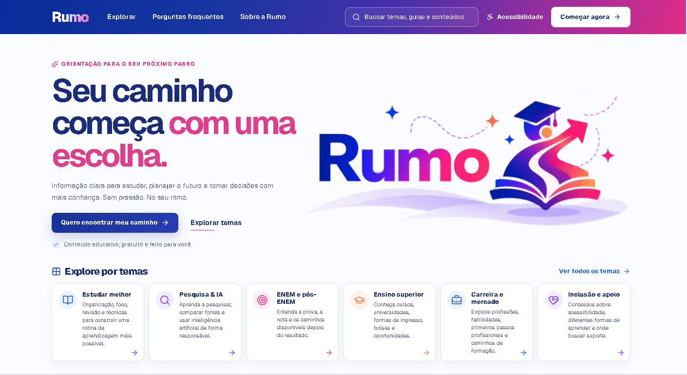
</a>
<em>Página inicial com hero, slogan "Aprenda, avance, conquiste" e acesso direto às seis áreas temáticas.</em>
</td>
</tr>
</table>

---

### Organização dos conteúdos — Categorias e guias

<table>
<tr>
<td align="center" width="50%">
<a href="docs/imagens-da-plataforma-desktop/02-Estudar-Melhor.png">
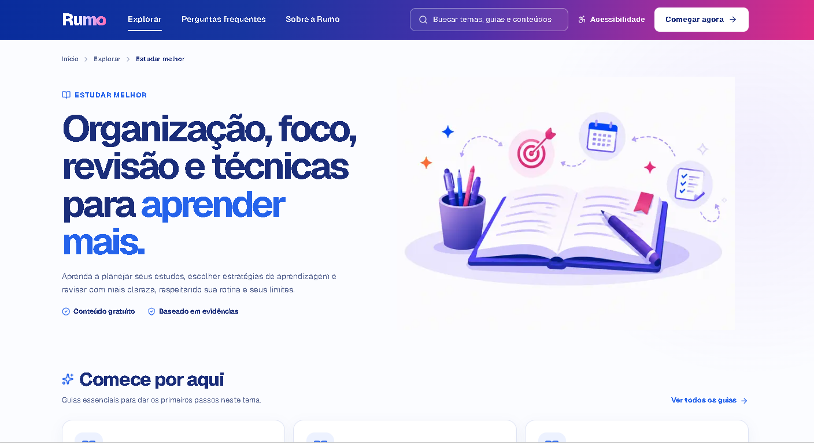
</a>
<em>Categoria "Estudar melhor" com trilhas de aprendizagem e guias em destaque.</em>
</td>
<td align="center" width="50%">
<a href="docs/imagens-da-plataforma-desktop/03-Guias-Essenciais-Estudar-Melhor.png">
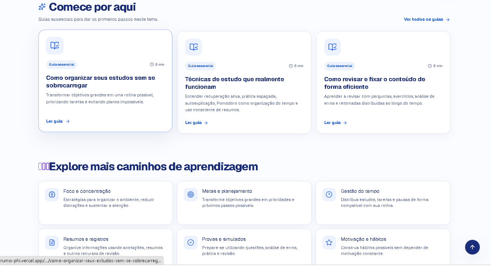
</a>
<em>Guias essenciais da categoria — cada cartão exibe título, resumo e tempo de leitura.</em>
</td>
</tr>
</table>

---

### Experiência de leitura — Dentro de um guia

<table>
<tr>
<td align="center" width="50%">
<a href="docs/imagens-da-plataforma-desktop/04-como-organizar-seus-estudos.png">
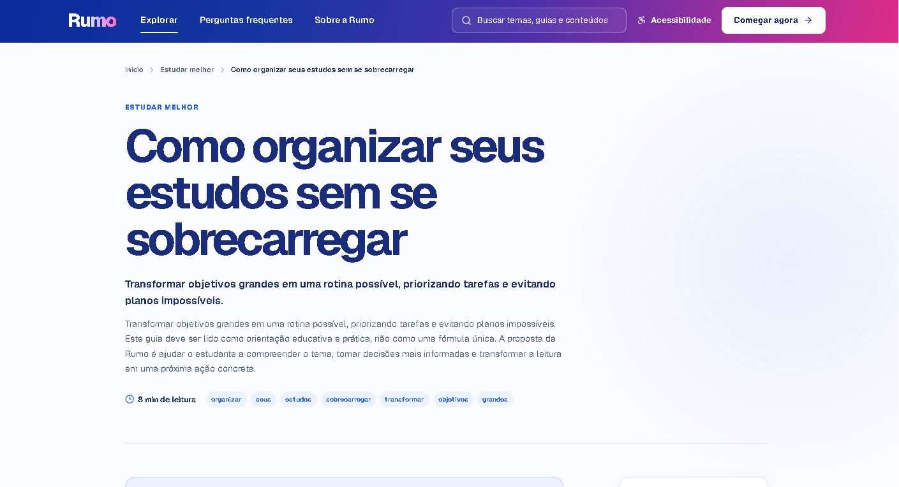
</a>
<em>Topo do guia com objetivos claros e introdução contextualizada.</em>
</td>
<td align="center" width="50%">
<a href="docs/imagens-da-plataforma-desktop/05-sumario-de-como-organizar-estudos.png">
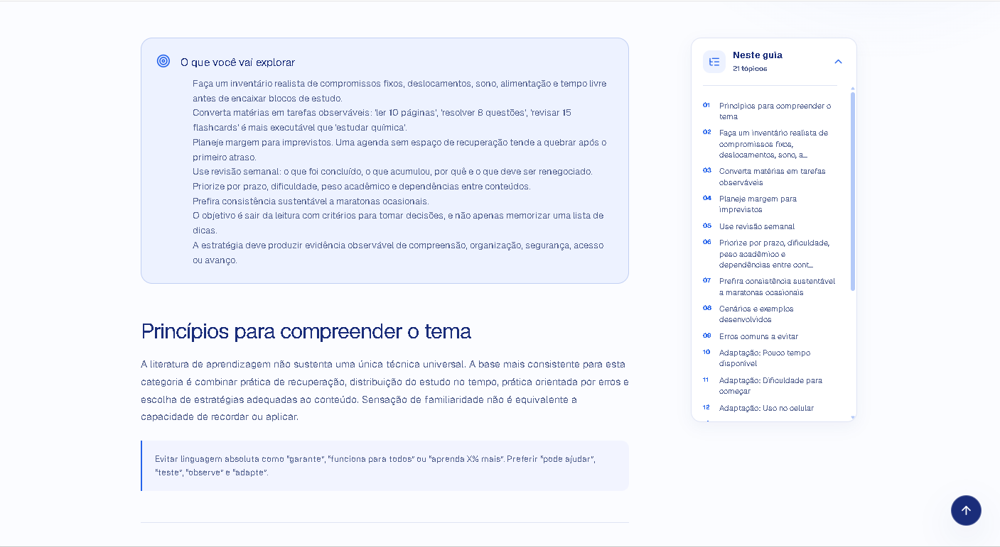
</a>
<em>Sumário clicável que permite navegar entre seções do guia sem rolar a página inteira.</em>
</td>
</tr>
</table>

---

### Busca por assunto

<table>
<tr>
<td align="center" width="60%">
<a href="docs/imagens-da-plataforma-desktop/06-busca.png">
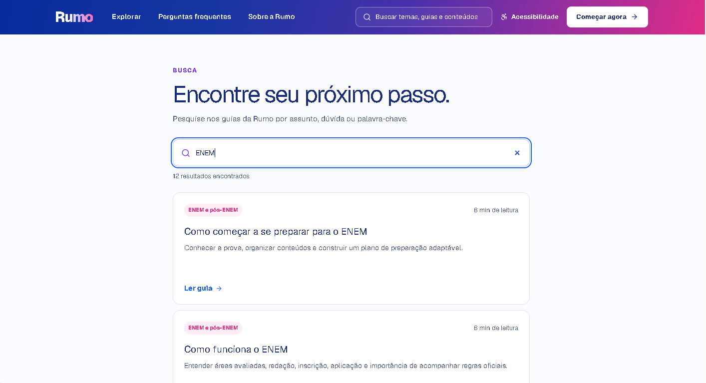
</a>
<em>Campo de busca com filtragem por título, resumo, tags e categoria.</em>
</td>
<td align="center" width="40%">
<a href="docs/imagens-da-plataforma-desktop/07-resultados-01.png">
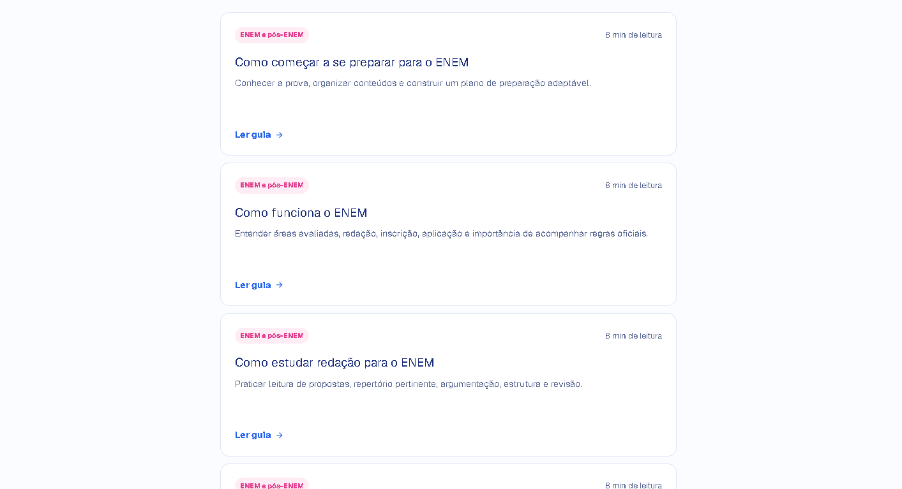
</a>
<em>Resultados exibidos por relevância, com categorias indicadas.</em>
</td>
</tr>
</table>

<details>
<summary>Ver segundo grupo de resultados</summary>

<table>
<tr>
<td align="center">
<a href="docs/imagens-da-plataforma-desktop/08-resultados-02.png">
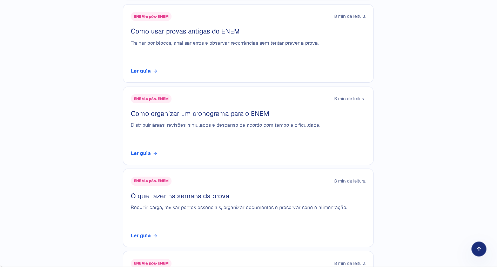
</a>
<em>Continuação dos resultados da busca.</em>
</td>
</tr>
</table>

</details>

---

### Acessibilidade — Painel de personalização

<table>
<tr>
<td align="center">
<a href="docs/imagens-da-plataforma-desktop/09-acessibilidade.png">
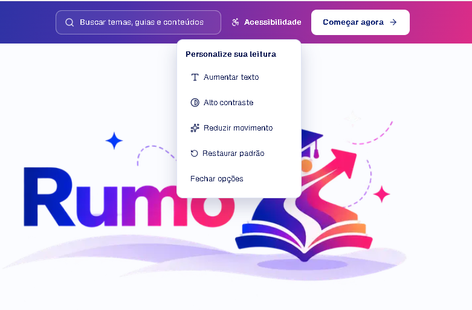
</a>
<em>Painel "Personalize sua leitura" com quatro opções: aumentar texto, alto contraste, reduzir movimento e restaurar padrão.</em>
</td>
</tr>
</table>

---

### Experiência mobile

<table>
<tr>
<td align="center" width="33%">
<a href="docs/imagens-da-plataforma-mobile/01-pagina-principal.png">
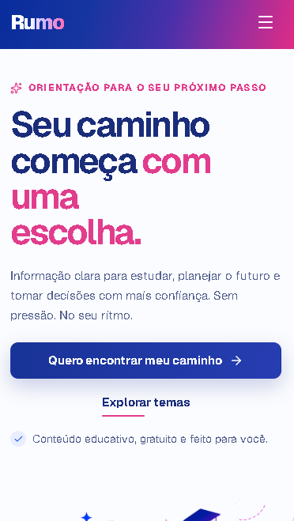
</a>
<em>Página inicial no celular com layout em coluna única.</em>
</td>
<td align="center" width="33%">
<a href="docs/imagens-da-plataforma-mobile/02-menu-aberto.png">
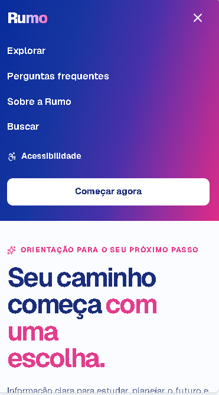
</a>
<em>Menu de navegação compacto com acesso às categorias e recursos.</em>
</td>
<td align="center" width="33%">
<a href="docs/imagens-da-plataforma-mobile/03-como-organizar-seus-estudos.png">
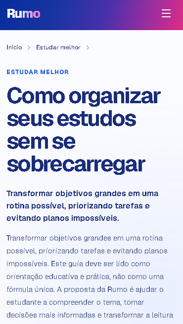
</a>
<em>Leitura de guia no celular com layout adaptado e texto legível.</em>
</td>
</tr>
</table>

---

### Sobre a Rumo — Apresentação institucional

<table>
<tr>
<td align="center" width="50%">
<a href="docs/imagens-da-plataforma-desktop/10-sobre-a-rumo.png">
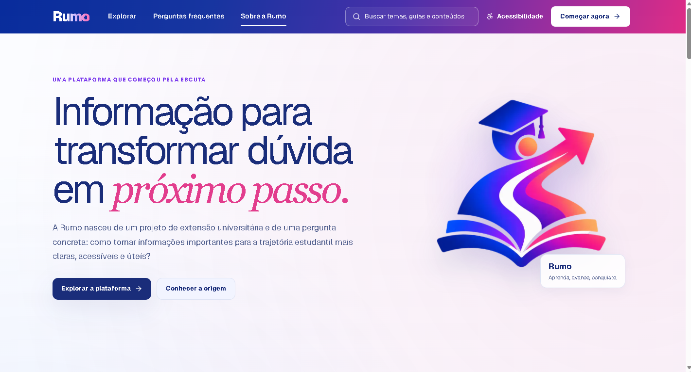
</a>
<em>Página "Sobre" com a história da plataforma e sua relação com o projeto de extensão.</em>
</td>
<td align="center" width="50%">
<a href="docs/imagens-da-plataforma-desktop/11-sobre-a-rumo-02.png">
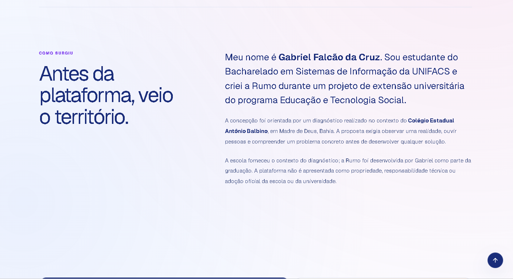
</a>
<em>Continuação da página com missão, valores e identidade da plataforma.</em>
</td>
</tr>
</table>

---

### Perguntas frequentes

<table>
<tr>
<td align="center" width="50%">
<a href="docs/imagens-da-plataforma-desktop/12-FAQ.png">
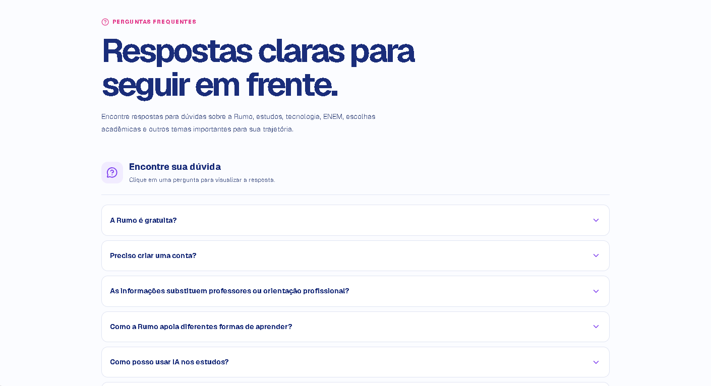
</a>
<em>Perguntas frequentes com respostas organizadas em acordeão expansível.</em>
</td>
<td align="center" width="50%">
<a href="docs/imagens-da-plataforma-desktop/13-Pergunta-Aberta.png">
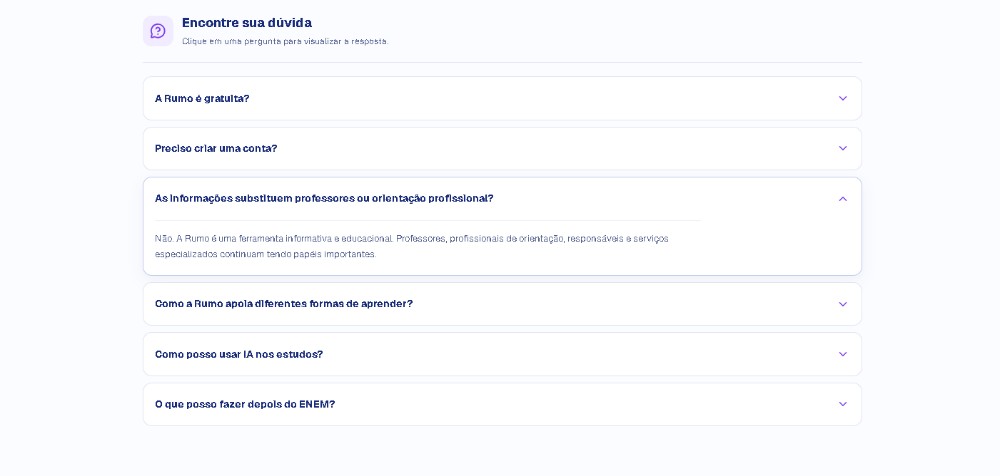
</a>
<em>Campo de pergunta aberta para consultas específicas do estudante.</em>
</td>
</tr>
</table>

---

## Reconhecimentos

O certificado de trabalho voluntário e a carta de recomendação estão previstos para a conclusão das atividades da extensão e serão disponibilizados após a emissão e autorização de publicação.

---

## Como executar o projeto

Ambiente validado: Node 22 e pnpm 10. No PowerShell, use `pnpm.cmd` se a política de execução bloquear `pnpm.ps1`.

```sh
pnpm install --frozen-lockfile
pnpm dev
```

Para executar a pipeline completa de validação (tipos, lint, testes e build):

```sh
pnpm validate
```

`validate` executa tipos, ESLint, testes de conteúdo e build. O build precisa acessar Google Fonts para obter Geist. Os testes compilam somente o módulo de conteúdo em `.validation/content-tests/` e usam o runner nativo do Node.

Para verificar HTTP, metadados, links, âncoras, imagens, busca e download, mantenha o servidor de produção em outro terminal:

```sh
pnpm start --port 3100
pnpm test:routes
```

### Scripts disponíveis

| Script | O que faz |
|---|---|
| `pnpm dev` | Servidor de desenvolvimento |
| `pnpm build` | Build de produção (com tipos bloqueantes) |
| `pnpm start` | Servidor de produção local |
| `pnpm typecheck` | Verificação de tipos TypeScript |
| `pnpm lint` | ESLint com `--max-warnings 0` |
| `pnpm test` | Cinco testes persistentes do catálogo de conteúdo |
| `pnpm validate` | Pipeline completa: typecheck + lint + test + build |
| `pnpm test:routes` | Verificação de rotas, metadados, links e assets via HTTP |

---

## Arquitetura e organização

```text
rumo/
├── app/                     rotas, metadados, layout global e fallbacks do Next.js
│   ├── [categoria]/
│   │   └── [slug]/          página de cada guia (geração estática)
│   ├── busca/               página de busca
│   ├── faq/                 perguntas frequentes
│   └── sobre/               apresentação do projeto
├── components/              componentes por responsabilidade
│   ├── accessibility/       painel de acessibilidade
│   ├── brand/               identidade visual e wordmark
│   ├── cards/               cartões de categoria e guia
│   ├── category/            hero, guias e trilhas de categoria
│   ├── faq/                 acordeão de perguntas
│   ├── guide/               hero, conteúdo, sumário, seções, fontes e download
│   ├── home/                hero, guias em destaque, tópicos e FAQ preview
│   ├── layout/              cabeçalho, rodapé, logo e scroll
│   └── loading/             tela inicial animada
├── modules/content/
│   ├── domain/              contratos de categorias, guias, FAQ e busca
│   ├── data/
│   │   ├── categories.ts    definição das seis categorias
│   │   ├── faqs.ts          perguntas frequentes
│   │   └── guides/          70 guias individuais em seis subpastas
│   └── services/            consultas locais e filtragem de busca
├── styles/                  oito arquivos CSS importados em ordem explícita
├── tests/                   testes persistentes de conteúdo
└── scripts/                 verificação de rotas e assets via HTTP
```

Guias novos precisam entrar no índice de sua categoria; as rotas estáticas exigem novo build. O domínio e os serviços não dependem de React. `components.json` e `lib/utils.ts` permanecem como configuração e utilitário para eventual geração de UI.

---

## Validação e qualidade

| Verificação | Resultado |
|---|---|
| `pnpm typecheck` | Passou |
| `pnpm lint` | Passou com `--max-warnings 0` |
| `pnpm test` | 5 testes, 5 aprovações; 70 guias nas 6 categorias confirmados |
| `pnpm build` | Passou com tipos bloqueantes e 82 entradas estáticas |
| `pnpm test:routes` | 80 páginas válidas, 81 hrefs internos distintos, âncoras e IDs sem falhas |
| Rotas inválidas | HTTP 404 + noindex + página de recuperação |
| Busca | 70 links; filtro por título, resumo, tags e categoria funcionando |
| Auditoria de segurança | 37 ocorrências iniciais → 0 após correções (08/09/2026) |
| Preservação de conteúdo | Hashes de 94 arquivos confirmados após limpeza |

> Esses resultados foram obtidos em servidor local de produção (Node 22 / pnpm 10). Responsividade visual em navegador, contraste WCAG, leitor de tela e comportamento em rede lenta não foram certificados por auditoria externa.

---

## Documentação

- [Mapeamento histórico da limpeza](Limpeza.md)
- [Execução e resultados da limpeza arquitetural](Limpeza-Execucao.md)
- [Auditoria arquitetural histórica](docs/arquitetura/ARCHITECTURE_AUDIT.md)
- [Origem e extensão universitária](docs/extensao/SobreMim.md)
- [Contexto pedagógico](docs/pedagogico/contexto-pedagogico.md)
- [Pesquisa dos 70 guias](docs/pedagogico/contexto-pedagogico-pesquisa-alto-nivel-70-guias.md)
- [Exemplos e aprofundamento de carreira](docs/pedagogico/complemento-pedagogico-exemplos-estrategicos-carreira-ats.md)
- [Especificação histórica de povoamento](docs/desenvolvimento/prompt-mestre-povoamento-70-guias-rumo.md)

Documentos históricos descrevem o estado de sua época. Os links da auditoria para arquivos removidos apontam para o commit que ainda os contém; caminhos citados em exemplos históricos não são instruções atuais.

---

## Autor e próximos passos

**Gabriel Falcão da Cruz** é estudante do Bacharelado em Sistemas de Informação da UNIFACS e desenvolvedor da Rumo. O projeto foi construído integralmente por ele, do diagnóstico territorial ao código em produção.

Ao longo do desenvolvimento, o projeto permitiu colocar em prática:

- levantamento de necessidades e escuta de comunidade;
- planejamento e priorização de funcionalidades;
- arquitetura modular e separação de responsabilidades;
- desenvolvimento web com Next.js App Router, React e TypeScript;
- organização editorial de conteúdo pedagógico;
- acessibilidade como parte da experiência, não como adendo;
- testes automatizados, lint e pipeline de validação;
- documentação técnica e histórica;
- responsabilidade social no desenvolvimento de software.

A Rumo começou como uma obrigação acadêmica e se tornou um projeto real. O projeto acadêmico foi o ponto de partida — a plataforma pode continuar evoluindo.

### Próximos passos realistas

- Revisão contínua dos conteúdos, especialmente os que dependem de dados atualizados (ENEM, Sisu, Prouni, Fies, mercado de trabalho);
- Incorporação de sugestões que emergirem da intervenção com a escola;
- Validação de acessibilidade em navegador real, com teclado e leitor de tela;
- Publicação da plataforma após autorização.

---

*A Rumo é uma plataforma de orientação estudantil criada por Gabriel Falcão da Cruz a partir de um projeto de extensão universitária do Bacharelado em Sistemas de Informação da UNIFACS. Sua concepção foi orientada por um diagnóstico realizado no contexto do Colégio Estadual Antônio Balbino, em Madre de Deus, Bahia.*
